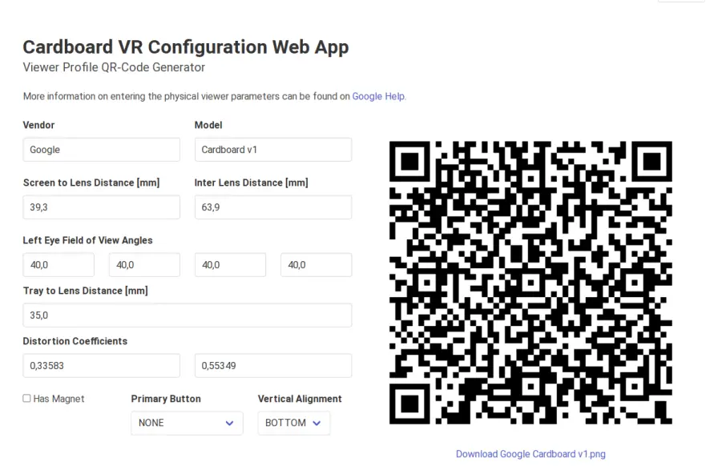

# Cardboard VR Viewer Profile Generator



The Viewer Profile Generator is a replacement for Google's dysfunctional viewerprofilegenerator. This project has a similar entry mask and is able to generate a QR-Code that can be scanned by a Cardboard VR App.

## Build

This commands will generate the Web App as a single fully functional HTML file.

```sh
npm install
make
```
